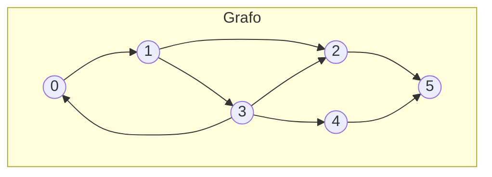
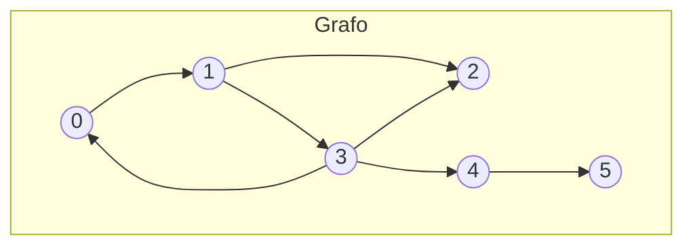

# Implementação TAD Grafo

## Descrição

Este projeto demonstra operações básicas com grafos usando uma representação por lista de adjacências em C++. As operações principais incluem:

* Inicializar um grafo,
* Adicionar e remover arestas,
* Verificar a existência de uma aresta,
* Imprimir o grafo,
* Calcular o grau dos vértices,
* Busca em largura (BFS),
* Busca em profundidade (DFS)
* Encontrar o menor caminho usando o algoritmo de Dijkstra.


## Dependências

* Compilador C++ (por exemplo, g++)
* Biblioteca padrão do C++


## Execução/Compilação

### Code::Blocks

1. Abra o Code::Blocks.
2. Clique em "File" -> "Open" e selecione o arquivo `TAD_Grafo.cbp`.
3. Clique em "Build" -> "Build and run".
4. O programa será compilado e executado.
5. Os resultados serão exibidos na janela de saída.

### CLion JetBrains

1. Abra o CLion.
2. Clique em "File" -> "Open" e selecione o arquivo `CMakeLists.txt`.
3. Selecione arquivo main.cpp e clique em "Run".
4. O programa será compilado e executado.
5. Os resultados serão exibidos na janela de saída.

## Arquivos

* `main.cpp`: contém a função principal e demonstra o uso das operações do grafo.
* `graph.h`: Arquivo de cabeçalho que define a estrutura do grafo (`GrafoPtr`) e os protótipos das funções.
* `graph.cpp`: Implementação das funções do grafo.
* `\tads_auxiliares`: Pasta com as TADS auxiliares para a implementação do grafo (Lista Dinamica Encadeada e Fila Estática).
    * `ListaDinamicaEncadeada.h`: Arquivo de cabeçalho que define a estrutura da lista dinâmica encadeada (`NoPrt`) e os protótipos das funções.
    * `ListaDinamicaEncadeada.cpp`: Implementação das funções da lista dinâmica encadeada.
    * `FilaEstatica.h`: Arquivo de cabeçalho que define a estrutura da fila estática (`FilaPtr`) e os protótipos das funções


## Teste de Mesa

O programa principal executa os seguintes passos:

1. **Inicializar o Grafo**: Um grafo direcionado com 6 vértices é inicializado.
2. **Inserir Arestas**: Arestas são adicionadas entre vários vértices.
3. **Remover uma Aresta**: Uma aresta é removida do grafo.
4. **Verificar Existência de Aresta**: Verifica se a aresta $1-3$ existe.
5. **Imprimir o Grafo**: A lista de adjacência do grafo é impressa.
6. **Calcular Graus dos Vértices**: O grau de cada vértice é impresso.
7. **Busca em Largura (BFS)**: A BFS é realizada a partir do vértice 1, e as distâncias do vértice inicial para todos os outros vértices são impressas.
8. **Busca em Profundidade (DFS)**: A DFS é realizada a partir do vértice 0, e as profundidades de todos os vértices são impressas.
9. **Menor Caminho (Algoritmo de Dijkstra)**: Os menores caminhos do vértice 0 para todos os outros vértices são calculados e impressos, juntamente com os caminhos.


### Representação do Gráfica

O grafo inicial é representado da seguinte forma:

$$
\begin{aligned}
G(V, E) \rightarrow &  V = \{0, 1, 2, 3, 4, 5\}, \\
&E = \{(0, 1), (1, 2), (1, 3), (2, 5), (3, 0), (3, 2), (3, 4), (4, 5)\}
\end{aligned}
$$



Após remover a aresta entre os vértices 2 e 5, o grafo fica assim:



Resultado da Impressão do Grafo:

```bash
0 -> L -> [ Aresta:1, Peso:0] -> nullptr
1 -> L -> [ Aresta:3, Peso:0] -> [ Aresta:2, Peso:0] -> nullptr
2 -> L -> nullptr
3 -> L -> [ Aresta:4, Peso:0] -> [ Aresta:2, Peso:0] -> [ Aresta:0, Peso:0] -> nullptr
4 -> L -> [ Aresta:5, Peso:0] -> nullptr
5 -> L -> nullptr
```

Resultado do Grau dos Vértices:

```bash
Grau do vertice 0: 2
Grau do vertice 1: 3
Grau do vertice 2: 2
Grau do vertice 3: 4
Grau do vertice 4: 2
Grau do vertice 5: 1
```

Resultado da Busca em Largura (BFS):

```bash
Distancias a partir do vertice 0:
Distancia para o vertice 0: 2
Distancia para o vertice 1: 0
Distancia para o vertice 2: 1
Distancia para o vertice 3: 1
Distancia para o vertice 4: 2
Distancia para o vertice 5: 3
```

Resultado da Busca em Profundidade (DFS):

```bash
Profundidades a partir do vertice 0:
Profundidade do vertice 0: 0
Profundidade do vertice 1: 1
Profundidade do vertice 2: 5
Profundidade do vertice 3: 2
Profundidade do vertice 4: 3
Profundidade do vertice 5: 4
```

Resultado do Menor Caminho (Algoritmo de Dijkstra):

```bash
Distancias e caminhos a partir do vertice 0:
Vertice 0: Distancia = 0, Caminho = 0
Vertice 1: Distancia = 1, Caminho = 0 -> 1
Vertice 2: Distancia = 2, Caminho = 0 -> 1 -> 2
Vertice 3: Distancia = 2, Caminho = 0 -> 1 -> 3
Vertice 4: Distancia = 3, Caminho = 0 -> 1 -> 3 -> 4
Vertice 5: Distancia = 4, Caminho = 0 -> 1 -> 3 -> 4 -> 5
```

## Funções Implementadas em `Graph.cpp`

* `void InicializaGrafo(GrafoPtr &G, int N, bool orientado)`: Inicializa o grafo com N vértices e define se é direcionado ou não.
* `void InsereAresta(GrafoPtr &G, int Origem, int Destino, float Peso)`: Insere uma aresta entre os vértices Origem e Destino com um peso especificado.
* `bool ExisteAresta(GrafoPtr &G, int Origem, int Destino)`: Verifica se existe uma aresta entre os vértices Origem e Destino.
* `void RetiraAresta(GrafoPtr &G, int Origem, int Destino)`: Remove a aresta entre os vértices Origem e Destino.
* `void ImprimeGrafo(GrafoPtr G)`: Imprime a lista de adjacências do grafo.
* `void LiberaGrafo(GrafoPtr &G)`: Libera a memória alocada para o grafo.
* `int GrauVertice(GrafoPtr G, int Vertice)`: Retorna o grau do vértice especificado.
* `NoPtr ListaAdjacencia(GrafoPtr G, int Vertice)`: Retorna a lista de adjacência do vértice especificado.
* `void BuscaEmLargura(GrafoPtr G, int Vertice, int *Visitado)`: Realiza a busca em largura a partir do vértice especificado.
* `void BuscaEmProfundidade(GrafoPtr G, int VerticeInicial, int *Profundidade)`: Realiza a busca em profundidade a partir do vértice especificado.
* `void BuscaEmProfundidadeRecursiva(GrafoPtr G, int Vertice, int *Profundidade, int &cont)`: Função recursiva auxiliar para a busca em profundidade.
* `void MenorCaminho(GrafoPtr G, int Origem, int *Distancia, int *Precedente)`: Encontra o menor caminho a partir do vértice de origem usando o algoritmo de Dijkstra.
* `void ImprimeCaminho(int *Precedente, int Destino)`: Imprime o caminho do vértice de origem até o vértice de destino.